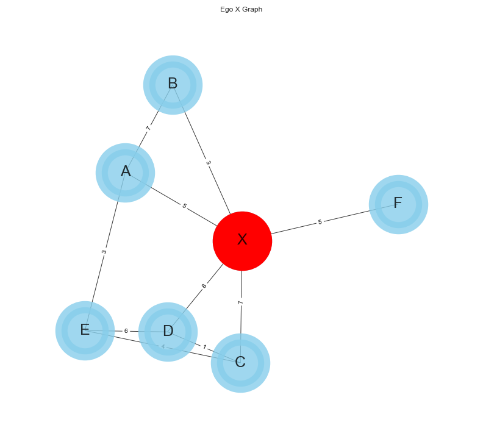

# Ego Networks Analyzer

Ego networks or Egocentric networks are **local** networks with a central node called **ego**.
They are very commonly used in social network analysis or when a full network is not available and thus many common metric cannot be calculated.

In an egonetwork, the nodes connected to the ego are called **alters** so usually the network defines some kind of social relationships.
So in general we can define some concepts  in an ego network:

- "**Ego**": The focal node of the network
- "**Alters**": The nodes connected to the ego node
- "**Ties**": A tie can be seen as an edge between two nodes and defines their relationship strength
- "**Neighborhood**" is the collection of ego and all nodes to whom ego has a connection at some path length. In social network analysis, the "neighborhood" is almost always one-step; that is, it includes only ego and actors that are directly adjacent. The neighborhood also includes all of the ties among all of the actors to whom ego has a direct connection. The boundaries of ego networks are defined in terms of neighborhoods.
- "**Simmelian Ties**": While the tie is usually dyadic (between two nodes), it's often useful to consider triads and so ties among three different people. When a triad includes the ego, we call this a Simmelian tie
- "**Structural holes**": The term _Structural Hole_ was defined by Ronald Burt. It refers to the strategical position of certain nodes in the network.
- "**Constraint**": Constraint (Constra) is a summary measure that taps the extent to which ego's connections are to others who are connected to one another. If ego's potential trading partners all have one another as potential trading partners, ego is highly constrained.  If ego's partners do not have other alternatives in the neighborhood, they cannot constrain ego's behavior.  The logic is pretty simple, but the measure itself is not. The idea of constraint is an important one because it points out that actors who have many ties to others may actually lose freedom of action rather than gain it -- depending on the relationships among the other actors.
A good way to think about constraints: If we consider a person X that tend to only talk and interact with the same people, their constraints are usually very high, it's hard for them to get out of their network and diversify their network. Let's consider instead people such as researchers, managers and CEOs: they often interact with people outside of their network, see this as a hole in the network where the externals partners are not linked to any other user in the inner circle. These people that talk to externals tend to be LESS constrained as they have access to more people outside of their immediate network.

From Burt's Formulation we can define the constraint calculation as:

Where the constraint Cij is the constraint between the node i and the node j:

Pij can be calculated as the normalized weight between node i and node j:

Where Zij is just the weight between node i and node j. If the graph is unweighted then Zij is 1 if there exists an edge between i and j, 0 otherwise.

In this case I decided to calculate the edge's weight as the number of unique conversations two users share. For istance, imagine a user's WhatsApp where they have one on one conversations but also gorup conversations. If user A and user B are together in say 10 conversations, the weight of the edge between A and B would be 10.

## References
- https://faculty.ucr.edu/~hanneman/nettext/C9_Ego_networks.html
- https://networkx.org/documentation/stable/reference/algorithms/generated/networkx.algorithms.structuralholes.constraint.html
